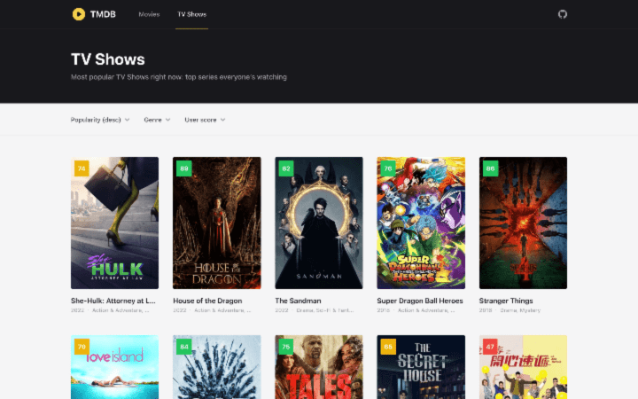

# TMDB (practice app)

TMDB allows users to find the most popular movies and TV shows.

## 🔥 Motivation
This project was written just to practice a few things:
* UI design with Tailwind CSS
* usage of Headless UI
* some functionality of React Query

## ⭐ Demo
[](https://tmdb-artes.vercel.app/)

## 🧐 Getting Started
These instructions will get you a copy of the project up and running on your local machine for development and testing purposes.

### Prerequisites
Clone the repository

```
git clone https://github.com/aszczepanowski/tmdb.git
```
Change directory to project directory
```
cd tmdb
```


### Installing dependencies
```
# Using npm
npm install

# Using yarn
yarn
```

### Running development server

```
# Using npm
npm run start

# Using yarn
yarn start
```

## 🤝 Built with
* [React](https://reactjs.org/)
* [TypeScript](https://www.typescriptlang.org/)
* [React Query](https://react-query-v3.tanstack.com/)
* [Axios](https://github.com/axios/axios)
* [Tailwind CSS](https://tailwindcss.com/)
* [Heroicons](https://heroicons.com/)
* [Headless UI](https://headlessui.com/react)
* [The Movie Database API v3](https://developers.themoviedb.org/3)
